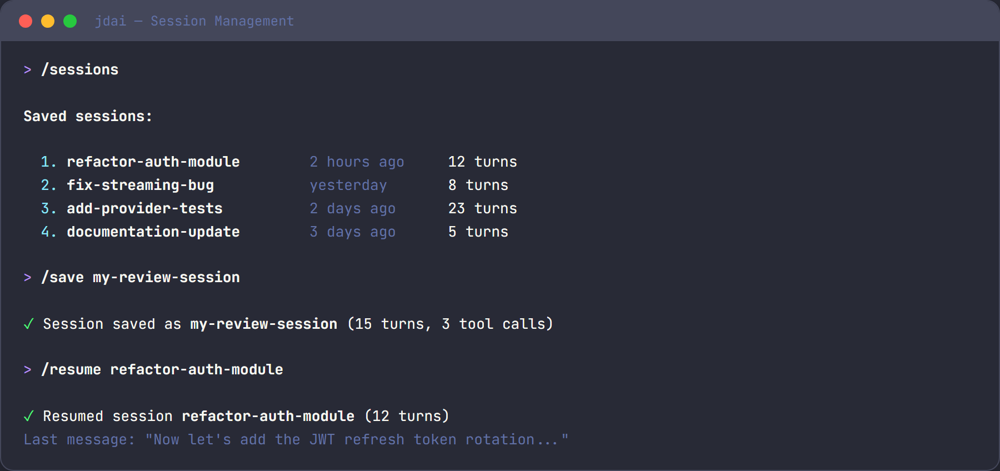

# Session Persistence

JD.AI automatically saves conversation history to a local SQLite database so you can resume where you left off. Sessions capture turns, token usage, tool calls, and files touched — giving you a complete record of each interaction.



## How It Works

- Sessions are stored in SQLite at `~/.jdai/sessions.db`
- Each session tracks turns, token usage, tool calls, and files touched
- Sessions are auto-saved when you exit

No external dependencies are required. The database is created on first run and managed transparently.

## Session Management Commands

### Save and Name Sessions

```text
/name my-feature          # Name the current session
/save                     # Explicitly save current state
```

Naming a session makes it easy to find later when you have many saved sessions.

### List and Resume Sessions

```text
/sessions                 # List recent sessions with ID, name, path, turns
/resume                   # Interactive session picker
/resume abc123            # Resume specific session by ID
```

### View History

```text
/history                  # Show turn-by-turn history with token counts
```

The history viewer supports interactive rollback — press <kbd>ESC</kbd> twice to open the browser and select a turn to revert to.

### Export Sessions

```text
/export                   # Export to JSON at ~/.jdai/exports/
```

Exported JSON includes the full conversation history, tool calls, and metadata.

## CLI Session Flags

| Flag | Description |
|------|-------------|
| `--resume <id>` | Resume a specific session on startup |
| `--new` | Start a fresh session (skip persistence) |

## What's Stored

### SessionInfo

| Field | Description |
|-------|-------------|
| `Id` | Unique session identifier |
| `Name` | User-assigned name (via `/name`) |
| `ProjectPath` | Working directory when session started |
| `CreatedAt` | Session creation timestamp |
| `UpdatedAt` | Last activity timestamp |
| `Turns` | Collection of conversation turns |

### TurnRecord

| Field | Description |
|-------|-------------|
| `Role` | User, Assistant, or System |
| `Content` | Message text |
| `PromptTokens` | Tokens in the prompt |
| `CompletionTokens` | Tokens in the completion |
| `ToolCalls` | Tools invoked during this turn |
| `FilesTouched` | Files read or modified |

### ToolCallRecord

| Field | Description |
|-------|-------------|
| `ToolName` | Name of the tool (e.g., `read_file`) |
| `Arguments` | JSON arguments passed |
| `Output` | Tool execution result |

## Storage Location

| Path | Purpose |
|------|---------|
| `~/.jdai/sessions.db` | Session database |
| `~/.jdai/exports/` | Exported session JSON files |
| `~/.jdai/update-check.json` | Update cache |

## Tips

- **Name sessions for easy recall**: `/name feature-auth` helps you find sessions later.
- **Compact before saving**: Use `/compact` to manage context before saving long sessions.
- **Export important sessions**: JSON backups ensure you never lose critical history.
- **Per-project filtering**: Sessions record the project path, so `/sessions` can filter by working directory.
