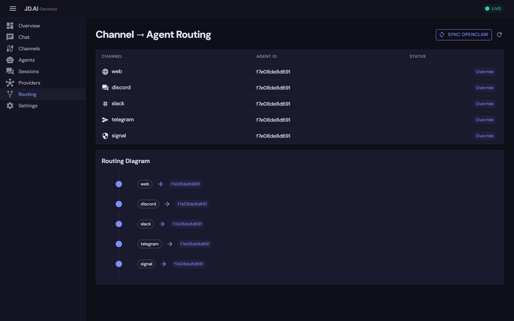

# OpenClaw Integration

OpenClaw is an open-source multi-AI gateway that orchestrates conversations across different AI providers and messaging platforms. The JD.AI ↔ OpenClaw integration connects the two gateways via the `OpenClawBridgeChannel`, enabling agents on either platform to communicate, share context, and route messages across boundaries.



## Why integrate with OpenClaw

| Scenario | Without integration | With integration |
|----------|-------------------|-----------------|
| **Multi-gateway routing** | Each gateway manages its own channels | Messages flow between gateways |
| **Provider diversity** | Limited to one gateway's providers | Combine both provider ecosystems |
| **Platform coverage** | Each gateway's channels only | Span platforms connected to either gateway |
| **Failover** | Single point of failure | Route through alternate gateway |

## Architecture

```
┌─────────────────────────────────────────────────┐
│                 JD.AI Gateway                    │
│                                                  │
│  ┌──────────┐ ┌──────────┐ ┌─────────────────┐  │
│  │ Discord  │ │ Telegram │ │ OpenClaw Bridge │──┼──┐
│  │ Channel  │ │ Channel  │ │    Channel      │  │  │
│  └────┬─────┘ └────┬─────┘ └────────┬────────┘  │  │
│       │             │                │           │  │
│  ┌────▼─────────────▼────────────────▼────────┐  │  │
│  │              Channel Registry              │  │  │
│  └────────────────────┬───────────────────────┘  │  │
│                       │                          │  │  HTTP
│  ┌────────────────────▼───────────────────────┐  │  │  (poll + post)
│  │              Agent Pool Service            │  │  │
│  └────────────────────────────────────────────┘  │  │
└──────────────────────────────────────────────────┘  │
                                                      │
┌─────────────────────────────────────────────────────▼──┐
│                   OpenClaw Gateway                      │
│  ┌──────────┐ ┌──────────┐ ┌──────────┐               │
│  │  Signal  │ │  Slack   │ │  Matrix  │  ...           │
│  └──────────┘ └──────────┘ └──────────┘               │
└─────────────────────────────────────────────────────────┘
```

### Communication protocol

- **Outbound (JD.AI → OpenClaw):** `POST /api/messages` with channel, content, sender, and metadata
- **Inbound (OpenClaw → JD.AI):** `GET /api/messages?since={timestamp}&channel={source}` polled at configurable interval

Messages include origin metadata to prevent routing loops:

```json
{
  "channel": "jdai-outbound",
  "content": "Here is the code review...",
  "sender": "jdai",
  "metadata": {
    "source": "jdai-gateway",
    "original_channel": "discord-123456"
  }
}
```

## Bridge hijack vs native channels

JD.AI supports two distinct integration shapes:

| Path | Transport owner | Who answers user messages | Best fit |
|------|------------------|---------------------------|----------|
| **Native channel adapters** (Discord/Signal/Slack/Telegram/Web) | JD.AI | JD.AI agent mapped to that channel | Primary JD.AI deployment |
| **OpenClaw bridge + Passthrough** | OpenClaw | OpenClaw agent (JD.AI observes) | Keep OpenClaw as primary runtime |
| **OpenClaw bridge + Intercept/Proxy** | OpenClaw transport, JD.AI execution | JD.AI (OpenClaw run is aborted or bypassed) | "Hijack" mode where JD.AI should answer |
| **OpenClaw bridge + Sidecar** | Shared | OpenClaw by default, JD.AI on trigger | Mixed mode with selective JD.AI takeover |

Operationally, "hijacking OpenClaw" means using **Intercept** or **Proxy** so JD.AI generates the assistant response while OpenClaw remains the session transport.

## Fast switching and handoff commands

You can switch routing/provider behavior at runtime without restarting either gateway.

### Native channels (Discord/Slack/Signal)

Use native channel commands:

```text
jdai-routes
jdai-route
jdai-route <agent-or-provider-or-model-fragment>
jdai-provider
jdai-provider <provider-name>
jdai-providers
```

Examples:

```text
jdai-route ollama
jdai-provider openai
jdai-routes
```

### OpenClaw bridge sessions

Inside an OpenClaw conversation, send `/jdai-...` commands. The bridge intercepts them, executes in JD.AI, and injects the result back into the session:

```text
/jdai-help
/jdai-routes
/jdai-route ollama
/jdai-provider openai
/jdai-status
```

### Practical switching behavior

- In **Sidecar** mode, plain messages continue to OpenClaw; `/jdai-...` commands and configured triggers route to JD.AI.
- In **Intercept/Proxy** mode, JD.AI is the active responder for routed messages.
- In **Passthrough** mode, OpenClaw remains responder; use `/jdai-...` commands for targeted control operations.

## Setup

### Prerequisites

- A running JD.AI Gateway instance
- A running OpenClaw instance with HTTP API enabled
- Network connectivity between the two gateways

### Step 1: Configure OpenClaw channels

Create two channels on the OpenClaw side:

- **`jdai-inbound`** — OpenClaw posts messages here for JD.AI
- **`jdai-outbound`** — JD.AI posts messages here for OpenClaw

### Step 2: Register the bridge

**Option A: DI registration**

```csharp
builder.Services.AddOpenClawBridge(config =>
{
    config.BaseUrl = "http://openclaw-host:3000";
    config.InstanceName = "production";
    config.ApiKey = "your-openclaw-api-key";
    config.TargetChannel = "jdai-outbound";
    config.SourceChannel = "jdai-inbound";
    config.PollIntervalMs = 1000;
});
```

**Option B: Gateway configuration**

```json
{
  "Gateway": {
    "Channels": [
      {
        "Type": "openclaw",
        "Name": "OpenClaw Production",
        "Settings": {
          "BaseUrl": "http://openclaw-host:3000",
          "InstanceName": "production",
          "ApiKey": "your-openclaw-api-key",
          "TargetChannel": "jdai-outbound",
          "SourceChannel": "jdai-inbound",
          "PollIntervalMs": "1000"
        }
      }
    ]
  }
}
```

### Step 3: Connect and verify

```bash
curl -X POST http://localhost:18789/api/channels/openclaw/connect \
     -H "X-API-Key: your-jdai-key"

curl http://localhost:18789/api/channels \
     -H "X-API-Key: your-jdai-key"
```

### Step 4: Route messages to an agent

```csharp
var registry = app.Services.GetRequiredService<IChannelRegistry>();
var pool = app.Services.GetRequiredService<AgentPoolService>();
var openClaw = registry.GetChannel("openclaw")!;

openClaw.MessageReceived += async (msg) =>
{
    var response = await pool.SendMessageAsync(targetAgentId, msg.Content);
    if (response is not null)
        await openClaw.SendMessageAsync(msg.ChannelId, response);
};
```

## Configuration reference

| Property | Type | Default | Description |
|----------|------|---------|-------------|
| `BaseUrl` | `string` | `http://localhost:3000` | OpenClaw HTTP API base URL |
| `InstanceName` | `string` | `local` | Friendly name for this instance |
| `ApiKey` | `string?` | `null` | API key for OpenClaw authentication |
| `TargetChannel` | `string` | `default` | Channel for outbound messages (JD.AI → OpenClaw) |
| `SourceChannel` | `string` | `default` | Channel for inbound messages (OpenClaw → JD.AI) |
| `PollIntervalMs` | `int` | `1000` | Milliseconds between inbound polls |

## Orchestration patterns

### Cross-platform agent routing

Route users from any platform to a JD.AI agent:

```
Discord (JD.AI) ──→ JD.AI Agent ←── Signal (OpenClaw)
Telegram (JD.AI) ──→              ←── Slack (OpenClaw)
```

### Provider failover

Use OpenClaw's providers when JD.AI's primary is unavailable:

```csharp
openClaw.MessageReceived += async (msg) =>
{
    var providers = await providerRegistry.DetectProvidersAsync(ct);
    if (providers.Any(p => p.IsAvailable))
    {
        var response = await pool.SendMessageAsync(localAgentId, msg.Content);
        await openClaw.SendMessageAsync(msg.ChannelId, response ?? "No response");
    }
    else
    {
        await openClaw.SendMessageAsync(msg.ChannelId, $"/route-to-agent {msg.Content}");
    }
};
```

### Platform-specific routing

```csharp
openClaw.MessageReceived += async (msg) =>
{
    var response = msg.Metadata.GetValueOrDefault("source_platform") switch
    {
        "signal" => await pool.SendMessageAsync(securityAgentId, msg.Content),
        "slack" => await pool.SendMessageAsync(devOpsAgentId, msg.Content),
        _ => await pool.SendMessageAsync(generalAgentId, msg.Content)
    };

    if (response is not null)
        await openClaw.SendMessageAsync(msg.ChannelId, response);
};
```

## Error handling and resilience

- **Connection verification** — `ConnectAsync` checks OpenClaw reachability before starting the poll loop
- **Poll failure backoff** — 5-second wait after poll errors
- **Graceful disconnection** — `DisconnectAsync` cancels the poll loop cleanly
- **HttpClient management** — `AddHttpClient<T>` provides connection pooling and DNS refresh

### Monitoring

```csharp
await foreach (var evt in eventHub.StreamEvents("channel.*"))
{
    Console.WriteLine($"[{evt.Timestamp:HH:mm:ss}] {evt.Type}: {evt.SourceId}");
}
```

### Health checks

```bash
curl http://localhost:18789/api/channels | jq '.[] | select(.channelType == "openclaw")'
```

## Troubleshooting

| Problem | Check |
|---------|-------|
| Bridge connects but no messages | Verify `SourceChannel` matches OpenClaw config |
| Messages sent but not received | Verify `TargetChannel` and `BaseUrl` |
| Connection fails on startup | Ensure OpenClaw is running and reachable |
| Duplicate messages | Ensure only one gateway polls the same channel |

## See also

- [Channel Adapters](channels.md) — all channel adapter guides
- [Gateway API](gateway-api.md) — REST endpoints and SignalR hubs
- [Team Orchestration](orchestration.md) — multi-agent coordination
