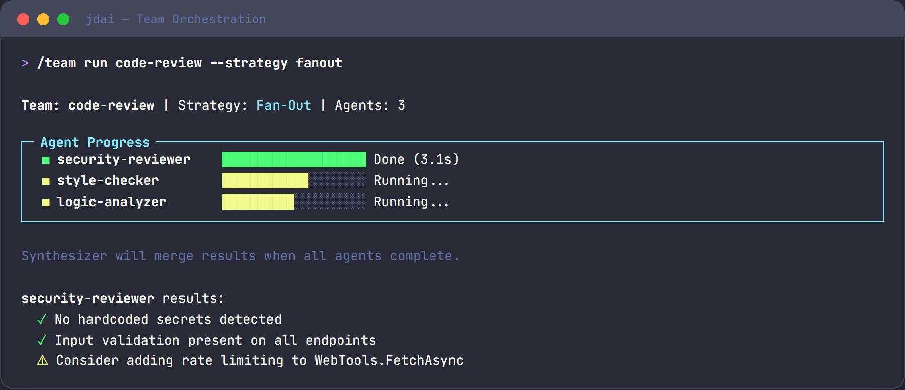

# Team Orchestration

Team orchestration coordinates multiple [subagents](subagents.md) working together on complex tasks. This guide covers the internals for developers who want to understand, customize, or extend the orchestration system.



## IOrchestrationStrategy interface

All strategies implement this interface from `src/JD.AI.Core/Agents/Orchestration/`:

```csharp
public interface IOrchestrationStrategy
{
    string Name { get; }
    Task<TeamResult> ExecuteAsync(
        IReadOnlyList<SubagentConfig> agents,
        TeamContext context,
        ISubagentExecutor executor,
        AgentSession parentSession,
        Action<SubagentProgress>? onProgress = null,
        CancellationToken ct = default);
}
```

| Parameter | Purpose |
|-----------|---------|
| `agents` | List of agent configurations (type, name, prompt, tools) |
| `context` | Shared state — scratchpad, event stream, results |
| `executor` | Abstraction for single/multi-turn execution |
| `parentSession` | Parent's session for provider/model access |
| `onProgress` | Callback for live progress updates (UI rendering) |

## Built-in strategies

### SequentialStrategy

Agents execute in pipeline order. Each receives the previous agent's output plus scratchpad access.

```csharp
public class SequentialStrategy : IOrchestrationStrategy
{
    public string Name => "sequential";

    public async Task<TeamResult> ExecuteAsync(...)
    {
        string previousOutput = "";
        foreach (var agent in agents)
        {
            var enrichedPrompt = $"{agent.Prompt}\n\nPrevious agent output:\n{previousOutput}";
            var result = await executor.ExecuteAsync(agent, enrichedPrompt, ct);
            context.AddResult(agent.Name, result);
            previousOutput = result.Output;
            onProgress?.Invoke(new SubagentProgress(agent.Name, "completed"));
        }
        return context.BuildTeamResult(Name);
    }
}
```

### FanOutStrategy

All agents run concurrently. A synthesizer merges results.

```csharp
public class FanOutStrategy : IOrchestrationStrategy
{
    public string Name => "fan-out";

    public async Task<TeamResult> ExecuteAsync(...)
    {
        // Run all agents in parallel
        var tasks = agents.Select(agent =>
            executor.ExecuteAsync(agent, agent.Prompt, ct));
        var results = await Task.WhenAll(tasks);

        // Store results in context
        for (int i = 0; i < agents.Count; i++)
            context.AddResult(agents[i].Name, results[i]);

        // Synthesize with a dedicated agent
        var synthesis = await SynthesizeResultsAsync(context, executor, ct);
        return context.BuildTeamResult(Name, synthesis);
    }
}
```

### SupervisorStrategy

A coordinator agent dispatches tasks dynamically, reviews results, and can redirect or retry.

### DebateStrategy

Multiple agents provide independent perspectives. A moderator synthesizes the best answer.

### VotingStrategy

All agents process the same prompt independently and each submits an answer. The orchestrator tallies votes — either via exact-match counting or an LLM-based consensus check — and returns the majority answer.

**When to use:** Factual questions, bug classification, label assignment, prioritization tasks where a single "correct" answer exists and independent agreement increases confidence.

**Configuration**

| Option | Type | Default | Description |
|--------|------|---------|-------------|
| `threshold` | `double` | `0.6` | Minimum fraction of agents that must agree (0.0 – 1.0) |

```csharp
var config = new TeamConfig
{
    Strategy = "voting",
    StrategyOptions = new Dictionary<string, string>
    {
        ["threshold"] = "0.7"   // 70 % agreement required
    },
    Agents =
    [
        new SubagentConfig { Name = "judge-a", Prompt = "Classify this bug severity: {issue}" },
        new SubagentConfig { Name = "judge-b", Prompt = "Classify this bug severity: {issue}" },
        new SubagentConfig { Name = "judge-c", Prompt = "Classify this bug severity: {issue}" },
    ]
};
```

When no threshold is met the orchestrator falls back to an LLM synthesis over all answers.

---

### PipelineStrategy

Each agent's output becomes the next agent's input plus accumulated context. Unlike `SequentialStrategy`, agents declare an explicit **input field** and **output field** that map to typed properties on an `AgentWorkflowData` object, enabling structured data to flow through the pipeline rather than raw strings.

**When to use:** Multi-stage transformation workflows — extract → transform → validate → format, document enrichment, ETL-style processing.

**Configuration**

Each `SubagentConfig` in a pipeline may carry `InputField` and `OutputField` annotations:

```csharp
var config = new TeamConfig
{
    Strategy = "pipeline",
    Agents =
    [
        new SubagentConfig
        {
            Name = "extractor",
            Prompt = "Extract structured data from: {raw_text}",
            OutputField = "extracted_json"
        },
        new SubagentConfig
        {
            Name = "transformer",
            Prompt = "Normalise this JSON: {extracted_json}",
            InputField  = "extracted_json",
            OutputField = "normalised_json"
        },
        new SubagentConfig
        {
            Name = "validator",
            Prompt = "Validate and flag issues in: {normalised_json}",
            InputField  = "normalised_json",
            OutputField = "validation_report"
        },
    ]
};
```

The `AgentWorkflowData` dictionary is stored on `TeamContext.Scratchpad` and is readable by all agents via `query_team_context`.

---

### MapReduceStrategy

**Map phase:** the input is split into chunks and distributed to agents concurrently (like `FanOutStrategy`). **Reduce phase:** a single designated *reducer* agent receives all map outputs and synthesises a final answer.

**When to use:** Large document processing, parallel code analysis across many files, aggregating statistics, any task where independent sub-tasks can be parallelised and then merged.

**Configuration**

| Option | Type | Default | Description |
|--------|------|---------|-------------|
| `reducerAgent` | `string` | last agent | Name of the agent that performs the reduce step |
| `chunkSize` | `int` | `4000` | Approximate token size of each input chunk |

```csharp
var config = new TeamConfig
{
    Strategy = "map-reduce",
    StrategyOptions = new Dictionary<string, string>
    {
        ["reducerAgent"] = "summariser",
        ["chunkSize"]    = "2000"
    },
    Agents =
    [
        new SubagentConfig { Name = "analyser", Prompt = "Summarise this section: {chunk}" },
        new SubagentConfig { Name = "summariser", Prompt = "Combine these summaries into one: {map_results}" },
    ]
};
```

The reducer agent receives a `map_results` scratchpad key containing all map outputs joined with section separators.

---

### RelayStrategy

Evaluates a set of routing conditions and forwards the request to **exactly one** matching agent. Unmatched conditions fall through to an optional default agent.

**When to use:** Intent classification followed by specialised handler routing, language-based routing, topic-based dispatch.

**Configuration**

Routing conditions are expressed as `Condition` strings on each `SubagentConfig`. The strategy evaluates them in order and executes the first match.

```csharp
var config = new TeamConfig
{
    Strategy = "relay",
    Agents =
    [
        new SubagentConfig
        {
            Name = "code-agent",
            Condition = "intent == 'code'",
            Prompt = "Answer this coding question: {input}"
        },
        new SubagentConfig
        {
            Name = "data-agent",
            Condition = "intent == 'data'",
            Prompt = "Analyse this data request: {input}"
        },
        new SubagentConfig
        {
            Name = "general-agent",
            Condition = "default",          // Fallback
            Prompt = "Answer this question: {input}"
        },
    ]
};
```

The `intent` variable is populated by an upstream classifier agent or by the `TeamContext.Scratchpad["intent"]` key.

---

### BlackboardStrategy

Agents share a common **blackboard** workspace implemented on `TeamContext.Scratchpad`. Agents run opportunistically in rounds: each agent inspects the blackboard, contributes relevant findings, and signals completion. The order of execution within a round can vary depending on what data is already present.

**When to use:** Complex problem-solving where agents must build on each other's partial findings, collaborative research tasks, multi-perspective analysis where contributions are interdependent.

**Configuration**

| Option | Type | Default | Description |
|--------|------|---------|-------------|
| `maxRounds` | `int` | `5` | Maximum number of rounds before forced termination |
| `convergenceKey` | `string` | `"done"` | Scratchpad key; when set to `"true"` by any agent, execution stops |

```csharp
var config = new TeamConfig
{
    Strategy = "blackboard",
    StrategyOptions = new Dictionary<string, string>
    {
        ["maxRounds"]      = "4",
        ["convergenceKey"] = "analysis_complete"
    },
    Agents =
    [
        new SubagentConfig
        {
            Name = "researcher",
            Prompt = "Review the blackboard and add any missing facts about: {topic}"
        },
        new SubagentConfig
        {
            Name = "critic",
            Prompt = "Review the blackboard facts and identify gaps or contradictions"
        },
        new SubagentConfig
        {
            Name = "synthesiser",
            Prompt = "If the blackboard has sufficient facts, write a final answer and set analysis_complete=true"
        },
    ]
};
```

Agents read and write the blackboard via the `query_team_context` and `write_team_context` SK functions. Each round is logged as a `TeamEvent`.

---

## TeamContext

All agents in a team share a `TeamContext` — a thread-safe shared state:

```csharp
public class TeamContext
{
    // Key-value scratchpad for sharing data between agents
    public ConcurrentDictionary<string, string> Scratchpad { get; }

    // Chronological event stream
    public IReadOnlyList<TeamEvent> Events { get; }

    // Per-agent results
    public IReadOnlyDictionary<string, AgentResult> Results { get; }

    public void AddEvent(TeamEvent evt);
    public void AddResult(string agentName, AgentResult result);
    public TeamResult BuildTeamResult(string strategyName, string? synthesis = null);
}
```

### TeamContext tools

Agents query shared context via the `query_team_context` SK function:

```csharp
[KernelFunction("query_team_context")]
[Description("Query shared team context")]
public string QueryTeamContext(
    [Description("Key: events, results, or a scratchpad key")] string key)
{
    return key switch
    {
        "events" => FormatEvents(_context.Events),
        "results" => FormatResults(_context.Results),
        _ => _context.Scratchpad.GetValueOrDefault(key, $"Key '{key}' not found")
    };
}
```

## SubagentConfig

Configure each agent in a team:

```csharp
public record SubagentConfig
{
    public string Name { get; init; }
    public SubagentType Type { get; init; }
    public string Prompt { get; init; }
    public string? SystemPrompt { get; init; }
    public int MaxTurns { get; init; } = 10;
    public string? ModelId { get; init; }
    public IReadOnlyList<string>? AdditionalTools { get; init; }
    public string? Perspective { get; init; }  // Used by DebateStrategy
}
```

## Result types

```csharp
public record AgentResult(
    string Output,
    int TokensUsed,
    TimeSpan ExecutionTime);

public record TeamResult(
    string FinalOutput,
    string StrategyName,
    IReadOnlyDictionary<string, AgentResult> AgentResults,
    int TotalTokens,
    TimeSpan TotalDuration);
```

## Implementing a custom strategy

### 1. Implement IOrchestrationStrategy

```csharp
public class RoundRobinStrategy : IOrchestrationStrategy
{
    public string Name => "round-robin";

    public async Task<TeamResult> ExecuteAsync(
        IReadOnlyList<SubagentConfig> agents,
        TeamContext context,
        ISubagentExecutor executor,
        AgentSession parentSession,
        Action<SubagentProgress>? onProgress = null,
        CancellationToken ct = default)
    {
        const int maxRounds = 3;
        for (int round = 0; round < maxRounds; round++)
        {
            foreach (var agent in agents)
            {
                var prompt = BuildRoundPrompt(agent, context, round);
                var result = await executor.ExecuteAsync(agent, prompt, ct);
                context.AddResult($"{agent.Name}-round-{round}", result);
                context.AddEvent(new TeamEvent(
                    $"{agent.Name} completed round {round}",
                    DateTimeOffset.UtcNow));

                onProgress?.Invoke(new SubagentProgress(
                    agent.Name, $"Round {round + 1}/{maxRounds} complete"));
            }
        }

        // Final synthesis
        var synthesis = await SynthesizeAsync(context, executor, ct);
        return context.BuildTeamResult(Name, synthesis);
    }
}
```

### 2. Register in DI

```csharp
services.AddSingleton<IOrchestrationStrategy, RoundRobinStrategy>();
```

The orchestration engine collects all `IOrchestrationStrategy` instances and matches by name.

## Progress events

The `onProgress` callback enables real-time UI rendering. JD.AI's Spectre.Console panel uses this to display agent status:

```csharp
onProgress?.Invoke(new SubagentProgress(
    AgentName: "security-reviewer",
    Status: "Analyzing authentication module...",
    IsComplete: false));
```

The progress panel shows:

- Current status per agent (running, completed, failed)
- Active task description
- Elapsed time

## Nesting guards

Orchestration includes depth guards to prevent infinite recursion:

- **Default max depth:** 2 levels of nesting
- **Configurable** via `AgentSession.MaxOrchestrationDepth`
- Teams that exceed the limit receive an error result

## Synthesis patterns

The synthesis step runs after all agents complete. Strategies use a dedicated synthesis prompt:

```csharp
private async Task<string> SynthesizeResultsAsync(
    TeamContext context, ISubagentExecutor executor, CancellationToken ct)
{
    var resultsBlock = string.Join("\n\n",
        context.Results.Select(r => $"## {r.Key}\n{r.Value.Output}"));

    var synthesisAgent = new SubagentConfig
    {
        Name = "synthesizer",
        Type = SubagentType.General,
        Prompt = $"Synthesize these results into a unified answer:\n\n{resultsBlock}"
    };

    var result = await executor.ExecuteAsync(synthesisAgent, synthesisAgent.Prompt, ct);
    return result.Output;
}
```

## Choosing a strategy

Use this decision guide to pick the right strategy for your use case:

```
Is the task order-dependent?
├── Yes → Do agents need structured typed data passed between them?
│         ├── Yes → PipelineStrategy
│         └── No  → SequentialStrategy
└── No  → Can all agents work from the same input independently?
          ├── Yes → Do you need a single agreed answer?
          │         ├── Yes → VotingStrategy
          │         └── No  → Is the input too large for one agent?
          │                   ├── Yes → MapReduceStrategy
          │                   └── No  → FanOutStrategy (with synthesis)
          └── No  → Does only one agent need to run?
                    ├── Yes → RelayStrategy (routing / dispatch)
                    └── No  → Do agents need to build on each other's findings iteratively?
                              ├── Yes → BlackboardStrategy
                              └── No  → Does a coordinator need to direct and retry agents?
                                        ├── Yes → SupervisorStrategy
                                        └── No  → DebateStrategy (independent perspectives + moderation)
```

### Quick-reference table

| Strategy | Agents run | Input | Best for |
|----------|-----------|-------|----------|
| `sequential` | One at a time, ordered | Previous output | Dependent pipeline steps |
| `pipeline` | One at a time, ordered | Typed `AgentWorkflowData` fields | Structured ETL / transformation |
| `fan-out` | All in parallel | Same prompt | Independent parallel analysis |
| `voting` | All in parallel | Same prompt | Consensus on a single answer |
| `map-reduce` | Map: parallel; Reduce: single | Input chunks | Large document / file processing |
| `relay` | One (condition-matched) | Original input | Intent routing |
| `blackboard` | Iterative rounds | Shared scratchpad | Collaborative, emergent reasoning |
| `supervisor` | Dynamic, coordinator-directed | Coordinator decision | Complex tasks requiring retry/redirect |
| `debate` | All in parallel, then moderated | Same prompt | Multi-perspective synthesis |

## See also

- [Subagents](subagents.md) — individual agent types and capabilities
- [Architecture Overview](index.md) — system architecture
- [Orchestration user guide](orchestration.md) — end-user documentation
