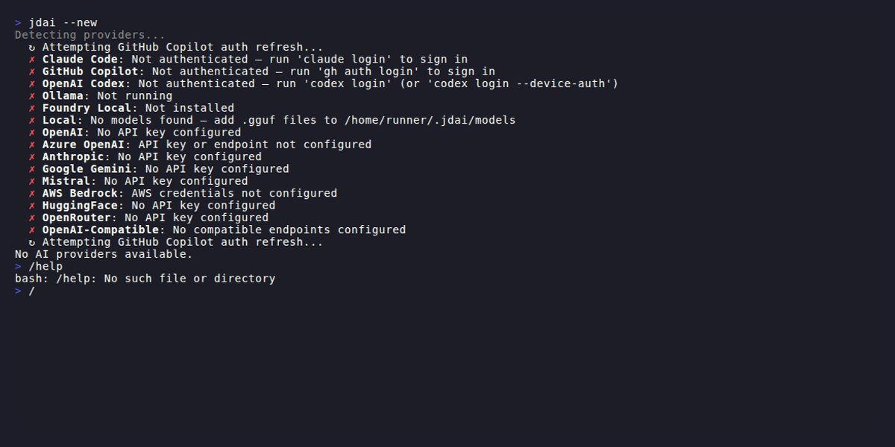

# Commands Reference

Use slash commands at the `>` prompt. Every command also accepts the `/jdai-` prefix for compatibility (example: `/jdai-help`, `/jdai-models`).



## Command groups

JD.AI currently supports 35+ interactive commands:

- Discovery and model/provider management
- Session and context controls
- Safety and execution controls
- Reviews and diagnostics
- Local models and MCP server management
- UX customization and persisted config
- Agent/hook profiles and project memory
- Skills lifecycle inspection and reload
- Workflows and checkpoints

## Discovery and model/provider commands

### `/help`

Shows all available commands and short descriptions.

### `/models`

Opens model browsing and interactive selection.

### `/model [id]`

Switches model by partial or full ID. Without an argument, opens the model picker.

```text
/model
/model claude-sonnet
/model gpt-4o
```

### `/model search <query>`

Search remote model catalogs (Ollama, HuggingFace, Foundry Local) for models matching the query.

```text
/model search llama 70b
/model search phi-3
```

Supports optional filters:

```text
/model search --provider openrouter --cap reasoning --sort cost llama
/model search --sort popularity gpt
```

### `/model url <url>`

Pull a model directly from a URL. Supports Ollama model URLs, HuggingFace repository URLs, and direct GGUF download links.

```text
/model url https://ollama.com/library/llama3.2
/model url https://huggingface.co/TheBloke/Mistral-7B-Instruct-v0.2-GGUF
```

### `/providers`

Lists detected providers and status.

### `/provider`

Manage and inspect providers. Without arguments, shows an interactive picker to switch between available providers.

| Subcommand | Description |
|---|---|
| `/provider list` | Show all providers with status, model count, and auth method |
| `/provider add <name>` | Interactive wizard to configure an API-key provider |
| `/provider remove <name>` | Remove stored credentials for a provider |
| `/provider test [name]` | Test provider connectivity (all or specific) |

Provider names for `/provider add`: `openai`, `azure-openai`, `anthropic`, `google-gemini`, `mistral`, `bedrock`, `huggingface`, `openai-compat`.

## Defaults management

### `/default`

Show the current default provider and model (global and per-project).

### `/default provider <name>`

Set the global default provider.

### `/default model <id>`

Set the global default model.

### `/default project provider <name>`

Set the per-project default provider for the current repo.

### `/default project model <id>`

Set the per-project default model for the current repo.

### `/update [status|check|plan [target|latest]|apply [target|latest]]`

Update orchestration commands:
- `status` — show update workflow config and enabled components
- `check` — check for available updates
- `plan` — print the ordered drain/update/restart/reconnect plan
- `apply` — execute the update workflow (subject to approval policy when enabled)

### `/doctor`

Runs environment diagnostics (runtime, providers, model count, tools, plugin load status, and CLI availability).

### `/docs [topic]`

Shows links to JD.AI documentation. Without a topic, lists key doc areas.

## Session and context commands

### `/clear`

Clears current conversation history for the active session.

### `/compact`

Triggers context compaction immediately.

### `/reasoning [auto|none|low|medium|high|max]`

Shows or sets session reasoning effort override for compatible reasoning models.

```text
/reasoning
/reasoning low
/reasoning max
/reasoning auto
```

### `/context`

Shows current context window usage with a visual bar.

### `/cost`

Shows current session token usage.

### `/sessions`

Lists recent sessions for the current project hash.

### `/resume [id]`

Resumes a previous session. With no ID, shows a list and usage hint.

### `/name <name>`

Sets a friendly name on the current session.

### `/history`

Shows a summarized turn history for the current session.

### `/export`

Exports current session to JSON under the JD.AI data directory.

### `/fork [name]`

Forks the active session into a new session branch, optionally named.

## Safety and execution controls

### `/autorun [on|off]`

Enables or disables auto-run behavior for tools.

> [!WARNING]
> `on` can allow writes, shell commands, and networked operations to execute without per-call confirmation.

### `/permissions [on|off]`

Enables or disables permission checks entirely for the current session.

> [!WARNING]
> `off` is equivalent to running with fully skipped confirmation behavior for that session.

### `/sandbox`

Shows available sandbox modes and configuration guidance.

### `/plan`

Toggles plan mode on/off for exploration-first behavior.

### `/copy`

Copies the last assistant response to clipboard.

### `/diff`

Shows uncommitted git diff (`git diff`, then staged diff fallback).

## Audit commands

### `/audit`

Shows recent audit events from the in-memory audit buffer. Supports filtering by severity. Use this command to inspect what actions the agent has taken, what tools were invoked, and whether any policy denials occurred.

```text
/audit
/audit --severity warning
/audit --limit 50
```

| Parameter | Description |
|---|---|
| `--severity` | Minimum severity level to display (`debug`, `info`, `warning`, `error`, `critical`) |
| `--limit` | Number of events to show (default: 20, max: 100) |

Output format:

```text
Audit Log (142 total events, showing 20)

.. 14:22:07 tool.invoke [read_file] — Debug
.. 14:22:08 tool.invoke [grep] — Debug
~~ 14:22:09 tool.invoke [run_command] — Warning
-- 14:22:10 session.create — Info
```

Severity icons in the output:

| Icon | Severity |
|------|----------|
| `..` | Debug |
| `--` | Info |
| `~~` | Warning |
| `**` | Error |
| `!!` | Critical |

For interactive filtering and programmatic access, see the [Gateway API Reference](../developer-guide/gateway-api.md) and [Audit Logging](../user-guide/audit-logging.md).

## Review and security commands

### `/review [--branch <name> --target <name>]`

Runs model-assisted code review over local changes or a branch comparison.

```text
/review
/review --branch feature/login --target main
```

### `/security-review [--full] [--branch <name> --target <name>]`

Runs OWASP/CWE-oriented heuristic security scanning.

- Default mode scans changed files.
- `--full` scans tracked repository files.

```text
/security-review
/security-review --full
/security-review --branch hotfix/auth --target main
```

## Local model commands

### `/local list`

Lists registered local GGUF models.

### `/local add <path>`

Registers a `.gguf` file or scans a directory.

### `/local scan [dir]`

Scans directory for local models (defaults to JD.AI model dir).

### `/local remove <model-id>`

Removes a model from the local registry (does not delete model file).

### `/local search <query>`

Searches HuggingFace for GGUF repositories.

### `/local download <repo-id>`

Downloads GGUF model from HuggingFace and registers it.

See [Local Models](../user-guide/local-models.md) for setup and storage behavior.

## MCP server commands

### `/mcp list`

Lists configured MCP servers and current status.

### `/mcp add <name> --transport stdio --command <cmd> [--args ...]`

Adds a stdio MCP server.

### `/mcp add <name> --transport http <url>`

Adds an HTTP MCP server.

### `/mcp remove <name>`

Removes a JD.AI-managed MCP server entry.

### `/mcp enable <name>`

Enables a configured MCP server.

### `/mcp disable <name>`

Disables a configured MCP server.

## Workflow and checkpoint commands

### `/workflow [list|show|export|replay|refine]`

Manages workflow artifacts captured from multi-step execution.

```text
/workflow list
/workflow show onboarding
/workflow export onboarding mermaid
/workflow replay onboarding
/workflow refine onboarding
```

### `/checkpoint [list|create|restore <id>|clear]`

Manages safety checkpoints for rollback.

```text
/checkpoint list
/checkpoint create before-refactor
/checkpoint restore abc123
/checkpoint clear
```

## UX, settings, and stats commands

### `/spinner [none|minimal|normal|rich|nerdy]`

Sets turn progress spinner style.

### `/theme [name]`

Lists or sets terminal theme.

Supported aliases:
`default`, `default-dark`, `monokai`, `solarized-dark`, `solarized-light`, `nord`, `dracula`, `one-dark`, `catppuccin`, `catppuccin-mocha`, `gruvbox`, `high-contrast`.

### `/vim [on|off]`

Toggles vim editing mode in the interactive prompt.

### `/output-style [rich|plain|compact|json]`

Sets renderer output mode.
`json` is session-only and is not persisted as the startup default.

### `/stats [--history|--daily]`

Shows session usage stats, cross-session stats, or daily aggregates.

### `/config [list|get <key>|set <key> <value>]`

Reads or writes persisted command-facing settings.

Supported keys:
`theme`, `vim_mode`, `output_style`, `spinner_style`, `prompt_cache`, `prompt_cache_ttl`, `autorun`, `permissions`, `plan_mode`, `welcome_model_summary`, `welcome_services`, `welcome_cwd`, `welcome_version`, `welcome_motd`, `welcome_motd_url`.

For cache behavior details and tuning guidance, see [Prompt Caching](prompt-caching.md).

### `/init`

Creates a starter `JDAI.md` in the current project if missing.

### `/instructions`

Displays merged instruction sources loaded into the prompt.

### `/plugins`

Manages installed Plugin SDK packages and runtime lifecycle.

Subcommands:

- `/plugins list` — list installed plugins with enabled/loaded status
- `/plugins install <path-or-url>` — install and enable plugin package
- `/plugins enable <id>` — enable plugin
- `/plugins disable <id>` — disable plugin
- `/plugins update [id]` — update one plugin or all installed plugins
- `/plugins uninstall <id>` — uninstall plugin package
- `/plugins info <id>` — show plugin details and last error

```text
/plugins
/plugins install https://example.com/My.Plugin.1.2.0.nupkg
/plugins update my-plugin
/plugins uninstall my-plugin
```

### `/skills [status|reload]`

Shows managed skill lifecycle state and supports on-demand refresh.

- `/skills` or `/skills status` prints deterministic skill eligibility status (`active`, `excluded`, `shadowed`, `invalid`) with reason codes.
- `/skills reload` forces a refresh from source directories and `skills.json` config.

```text
/skills
/skills status
/skills reload
```

## Profile and memory commands

### `/agents [list|create|delete|set]`

Manages local agent profiles in `~/.jdai/agents.json`.

```text
/agents list
/agents create reviewer
/agents set reviewer model gpt-4o
/agents set reviewer tools read_file,grep,git_diff
```

### `/hooks [list|create|delete|toggle|set]`

Manages local hook profiles in `~/.jdai/hooks.json`.

```text
/hooks list
/hooks create lint-on-save
/hooks set lint-on-save command dotnet format --verify-no-changes
/hooks toggle lint-on-save
```

### `/memory [show|edit|append|reset]`

Views or updates project memory file (`JDAI.md`) in the current repository.

```text
/memory show
/memory append Prefer xUnit for unit tests
/memory reset
```

## Exit commands

### `/quit`
### `/exit`

Ends the JD.AI interactive session.

## Gateway channel commands

Gateway adapters expose command variants natively per platform:

- Discord: slash commands (example: `/jdai-help`)
- Slack: slash commands (example: `/jdai-help`)
- Signal: command prefix form (example: `!jdai-help`)
- OpenClaw bridge: message commands (example: `/jdai-help`)

### `jdai-help`

Lists gateway command usage.

### `jdai-usage`

Shows uptime, turn counts, and per-agent usage.

### `jdai-status`

Shows current agent/channel status.

### `jdai-models`

Lists providers/models available to the gateway runtime.

### `jdai-switch <model> [provider]`

Switches spawned agent model/provider.

### `jdai-clear [agent]`

Clears one agent conversation or all if omitted.

### `jdai-agents`

Lists active gateway agents and route mappings.

### `jdai-route [agent]`

Shows the current channel route or remaps the current channel to a matching agent/provider/model.

```text
jdai-route
jdai-route ollama
jdai-route gpt-5.3-codex
```

### `jdai-routes`

Lists all channel-to-agent mappings.

### `jdai-provider [name]`

Shows current mapped agent provider or switches the mapped channel to a newly spawned agent on the selected provider.

```text
jdai-provider
jdai-provider openai
jdai-provider ollama
```

### `jdai-providers`

Lists detected provider availability and models from the gateway runtime.

### OpenClaw bridge invocation

When issuing gateway commands from an OpenClaw conversation, always use `/jdai-` prefix messages:

```text
/jdai-routes
/jdai-route ollama
/jdai-provider openai
```

## Quick reference

| Command | Purpose |
|---|---|
| `/help` | Command list |
| `/models`, `/model`, `/model search`, `/model url` | Model browsing, switching, search, and pull by URL |
| `/providers`, `/provider`, `/default ...` | Provider discovery, credential management, and defaults |
| `/sessions`, `/resume`, `/name`, `/fork` | Session lifecycle |
| `/clear`, `/compact`, `/context`, `/cost`, `/history`, `/export` | Context/session operations |
| `/autorun`, `/permissions`, `/sandbox`, `/plan` | Safety and execution mode |
| `/audit` | Inspect audit events with optional severity filter |
| `/review`, `/security-review` | Code and security review |
| `/local ...` | Local model operations |
| `/mcp ...` | MCP server management |
| `/checkpoint ...`, `/workflow ...` | Checkpointing and workflows |
| `/theme`, `/vim`, `/spinner`, `/output-style`, `/stats`, `/config` | UX and runtime settings |
| `/agents`, `/hooks`, `/memory`, `/init`, `/instructions`, `/plugins`, `/skills`, `/doctor`, `/docs` | Project and profile operations |
| `/quit`, `/exit` | Exit session |
