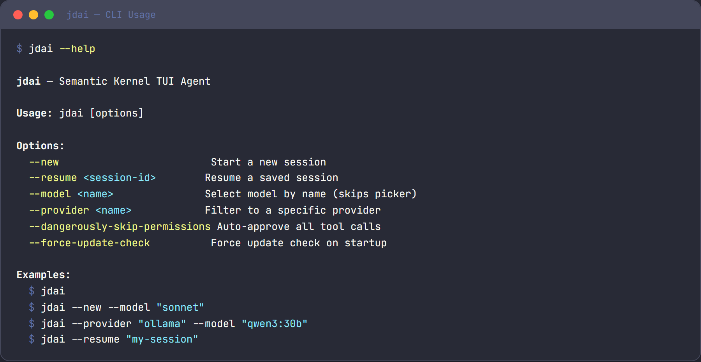

# Installation

Get JD.AI up and running on your machine. This page covers prerequisites, installation methods, first run, and basic CLI options. For provider-specific setup, see [Provider Setup](provider-setup.md).



## Prerequisites

- [.NET 10.0 SDK](https://dotnet.microsoft.com/download) or later (not required for native binary installs)
- At least one AI provider configured (see [Provider Setup](provider-setup.md))

Verify your .NET version:

```bash
dotnet --version
# Should output 10.0.x or later
```

## Install as a global .NET tool

The recommended way to install JD.AI is as a global .NET tool from NuGet:

```bash
dotnet tool install --global JD.AI
```

This makes the `jdai` command available system-wide.

### Update to the latest version

```bash
dotnet tool update --global JD.AI
```

You can also update from within JD.AI using `jdai update` or the `/update` slash command (see [Updating](#updating) below).

### Install to a local path

If you prefer not to install globally, use `--tool-path`:

```bash
dotnet tool install JD.AI --tool-path ./tools
./tools/jdai
```

## Install as a native binary (no .NET required)

Pre-built self-contained binaries are published to [GitHub Releases](https://github.com/JerrettDavis/JD.AI/releases) for every release. No .NET SDK is needed.

1. Download the archive for your platform from the latest release:

   | Platform | Asset |
   |----------|-------|
   | Windows x64 | `jdai-win-x64.zip` |
   | Windows ARM64 | `jdai-win-arm64.zip` |
   | Linux x64 | `jdai-linux-x64.tar.gz` |
   | Linux ARM64 | `jdai-linux-arm64.tar.gz` |
   | macOS Intel | `jdai-osx-x64.tar.gz` |
   | macOS Apple Silicon | `jdai-osx-arm64.tar.gz` |

2. Extract and place the binary on your `PATH`:

   ```bash
   # Linux / macOS
   tar -xzf jdai-linux-x64.tar.gz -C ~/.local/bin/

   # Windows (PowerShell)
   Expand-Archive jdai-win-x64.zip -DestinationPath "$env:LOCALAPPDATA\jdai"
   # Then add that directory to your PATH
   ```

3. Verify:

   ```bash
   jdai --print "hello"
   ```

Once installed, use `jdai update` to update to newer releases without repeating these steps.

## Install from source

Clone the repository and build locally:

```bash
git clone https://github.com/JerrettDavis/JD.AI.git
cd JD.AI
dotnet build
dotnet run --project src/JD.AI
```

## First run

Launch JD.AI in any project directory:

```bash
cd /path/to/your/project
jdai
```

On startup, JD.AI:

1. Checks for available AI providers
2. Displays detected providers and models
3. Selects the best available provider
4. Loads project instructions (`JDAI.md`, `CLAUDE.md`, etc.)
5. Shows the welcome banner

If no providers are detected, JD.AI will prompt you to configure one. The quickest way is to set an API key environment variable:

```bash
export OPENAI_API_KEY=sk-...
jdai --provider openai
```

See [Provider Setup](provider-setup.md) for all 15 providers.

## Common CLI options

| Flag | Description |
|------|-------------|
| `--provider <name>` | Use a specific provider (e.g. `openai`, `anthropic`) |
| `--model <name>` | Use a specific model |
| `--resume <id>` | Resume a previous session by ID |
| `--continue` | Continue the most recent session |
| `--new` | Start a fresh session |
| `--print` | Non-interactive mode — print the response and exit |
| `--output-format <fmt>` | Output format: `text`, `json`, or `markdown` |
| `--verbose` | Enable debug logging |
| `--dangerously-skip-permissions` | Skip all tool confirmations |

For the full list, run `jdai --help`.

## Verify the installation

After installing, confirm everything works:

```bash
jdai --print "hello, are you working?"
```

JD.AI should detect a provider, send the prompt, and print a response.

## Updating

JD.AI includes built-in `update` and `install` CLI commands that detect how the tool was installed and apply updates using the appropriate method.

### `jdai update`

Checks for a newer version and applies it:

```bash
jdai update
```

JD.AI automatically detects the installation method (dotnet tool, native binary, winget, chocolatey, scoop, brew, or apt) and runs the correct upgrade command. For native binary installs, it downloads the latest release from GitHub and replaces the binary in-place.

| Flag | Description |
|------|-------------|
| `--check` | Check for updates without applying them |
| `--force` | Force update even if already on the latest version |

### `jdai install`

Downloads and installs a specific version from GitHub Releases as a native binary. No .NET SDK required:

```bash
# Install the latest version
jdai install

# Install a specific version
jdai install 1.2.0

# Force reinstall
jdai install --force
```

This always uses the GitHub release strategy regardless of the original installation method, making it useful for switching from a dotnet tool install to a self-contained binary.

### In-session updates

You can run update workflow commands in-session:
- `/update status`
- `/update check`
- `/update plan [target|latest]`
- `/update apply [target|latest]`

JD.AI checks for updates automatically on startup and displays a notification when a newer version is available.

#### Operator safety and rollback notes

- Run `/update plan` before `/update apply` to verify component order and timing windows.
- Keep `updates.requireApproval=true` in shared/operator environments.
- Use conservative `updates.drainTimeout` and `updates.reconnectTimeout` values to avoid dropping in-flight work.
- If an update fails, reinstall a known-good version via `dotnet tool install/update -g <package> --version <known-good>` and restart services.

## Uninstall

```bash
dotnet tool uninstall --global JD.AI
```

## Next steps

- [Quickstart](quickstart.md) — walk through your first real task
- [Provider Setup](provider-setup.md) — configure AI providers
- [Configuration](configuration.md) — customize JD.AI for your projects
