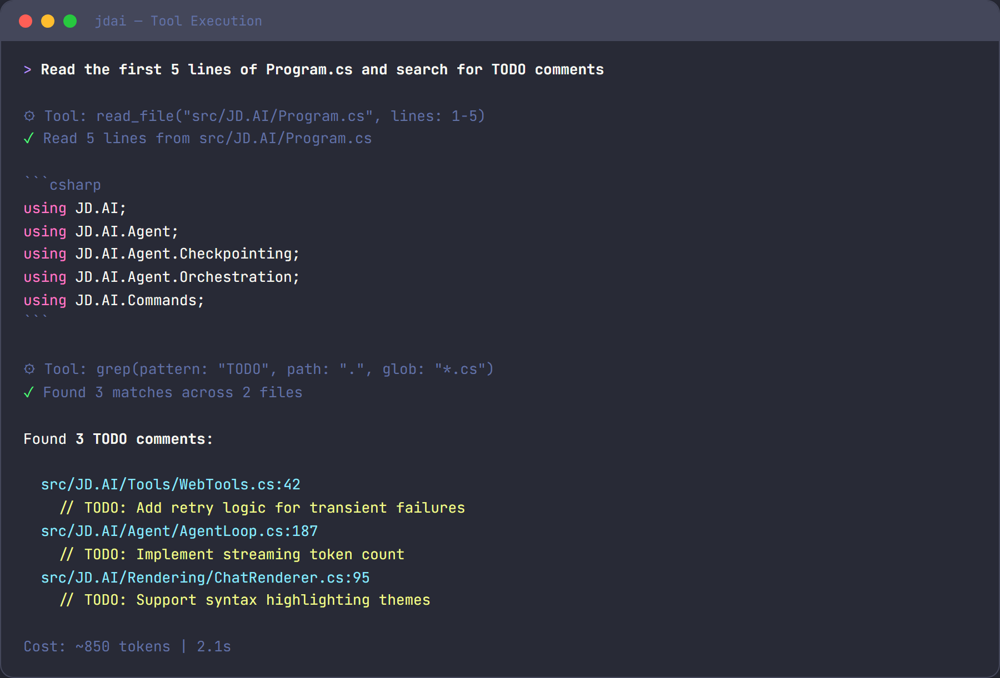

# Tools

JD.AI provides 19 categories of built-in tools that the AI agent invokes automatically during conversations. You don't call tools directly — describe what you want in natural language and JD.AI selects the right tool. Each tool call is confirmed before execution unless you've enabled auto-run.



For full parameter documentation, see the [Tools Reference](../reference/tools.md).

## Tool categories at a glance

| Category | Tools | What it does |
|----------|-------|-------------|
| **File** | `read_file`, `write_file`, `edit_file`, `list_directory` | Read, write, and browse files |
| **Search** | `grep`, `glob` | Find text in files and locate files by pattern |
| **Shell** | `run_command` | Execute shell commands |
| **Git** | `git_status`, `git_diff`, `git_log`, `git_commit`, `git_push`, `git_pull`, `git_branch`, `git_checkout`, `git_stash` | Full git workflow |
| **Web** | `web_fetch` | Fetch a URL and return readable text |
| **Web Search** | `web_search` | Search the web for current information |
| **Memory** | `memory_store`, `memory_search`, `memory_forget` | Semantic memory for cross-turn recall |
| **Subagent** | `spawn_agent`, `spawn_team`, `query_team_context` | Delegate work to specialized agents |
| **Think** | `think` | Scratchpad for reasoning — no side effects |
| **Environment** | `get_environment` | System info: OS, runtime, disk space, tooling |
| **Tasks** | `create_task`, `list_tasks`, `update_task`, `complete_task`, `export_tasks` | Track work items |
| **Code Execution** | `execute_code` | Run snippets in C#, Python, Node.js, Bash, or PowerShell |
| **Clipboard** | `read_clipboard`, `write_clipboard` | Read from and write to the system clipboard |
| **Questions** | `ask_questions` | Present structured questionnaires to you |
| **Diff / Patch** | `create_patch`, `apply_patch` | Create and apply unified diffs atomically |
| **Batch Edit** | `batch_edit_files` | Multi-file text replacements in one atomic operation |
| **Usage** | `get_usage`, `reset_usage` | Token counts and cost estimates |
| **Encoding & Crypto** | `encode_base64`, `decode_base64`, `encode_url`, `decode_url`, `decode_jwt`, `hash_compute`, `generate_guid` | Encoding, decoding, hashing, and cryptographic utilities |
| **Tailscale** | `tailscale_status`, `tailscale_machines`, `tailscale_configure`, `tailscale_runner_probe`, `tailscale_export` | Tailscale Tailnet discovery and remote orchestration |

## File tools

Read, create, and edit files. The agent reads files to understand your code and writes files to make changes.

```text
> read the first 20 lines of Program.cs
⚡ Tool: read_file(path: "Program.cs", startLine: 1, endLine: 20)
```

`edit_file` replaces exactly one occurrence of a string — surgical, minimal edits rather than full rewrites.

## Search tools

Find text across your codebase with `grep` (regex search) or locate files with `glob` (pattern matching).

```text
> find all files that reference ILogger
⚡ Tool: grep(pattern: "ILogger", glob: "**/*.cs")
```

## Shell tools

Execute any shell command. The agent uses this for builds, tests, linting, and anything else that needs the terminal.

```text
> run the tests
⚡ Tool: run_command(command: "dotnet test", timeoutSeconds: 120)
```

## Git tools

A full git workflow — status, diff, log, commit, push, pull, branch, checkout, and stash. The agent drafts commit messages based on your changes and stages everything before committing.

```text
> commit my changes with a descriptive message
⚡ Tool: git_commit(message: "feat: add input validation to registration form")
```

## Web tools

Fetch any URL and get back readable text, or search the web for current information.

```text
> search for the latest .NET 9 breaking changes
⚡ Tool: web_search(query: ".NET 9 breaking changes", count: 5)
```

## Memory tools

Store and recall facts across the conversation using semantic memory. Useful for remembering architectural decisions, API patterns, or any context you want to persist.

```text
> remember that the API key is stored in Azure Key Vault
⚡ Tool: memory_store(text: "API key is stored in Azure Key Vault", category: "architecture")
```

## Subagent tools

Delegate focused work to specialized subagents that run in their own context window. This keeps your main conversation clean while offloading research, code review, or command execution.

| Agent type | Best for |
|-----------|----------|
| `explore` | Codebase research — read-only, no context cost |
| `task` | Running commands and reporting results |
| `plan` | Creating structured implementation plans |
| `review` | Code review with actionable feedback |
| `general` | Complex multi-step work |

## Think tool

A scratchpad the agent uses to reason through problems before acting. No side effects — it simply records a thought and moves on. You'll see these in the tool call stream as the agent plans its approach.

## Environment tools

Returns system information — OS, architecture, runtime version, disk space, and installed tooling. Helps the agent write platform-appropriate commands.

## Task tools

Track work items within a session. The agent can create tasks, mark them in progress or done, and export the full list as JSON.

## Code execution tools

Run code snippets directly — supports C#, Python, Node.js, Bash, and PowerShell. Useful for quick validation, testing a regex, or running a one-off calculation.

```text
> test this regex in python
⚡ Tool: execute_code(language: "python", code: "import re; print(re.findall(r'\\d+', 'abc 123 def 456'))")
```

## Clipboard tools

Read from and write to the system clipboard. Cross-platform: uses PowerShell/clip on Windows, pbcopy/pbpaste on macOS, and xclip/xsel on Linux.

## Encoding & Crypto tools

Encode, decode, hash, and inspect common developer data formats without leaving JD.AI.

```text
> encode this string to base64
⚡ Tool: encode_base64(text: "Hello, World!")

> decode this JWT
⚡ Tool: decode_jwt(token: "eyJhbGciOiJSUzI1NiIsInR5cCI6IkpXVCJ9...")

> generate a new GUID
⚡ Tool: generate_guid(count: 1)
```

> [!WARNING]
> `decode_jwt` inspects token contents only — it does **not** verify the signature. Do not rely on it for authentication decisions.
>
> `MD5` and `SHA1` are cryptographically weak. Prefer `SHA256` or `SHA512` for any security-sensitive hashing.

## Tailscale Integration tools

Discover and orchestrate machines on your Tailscale Tailnet. Requires Tailscale CLI (`tailscale`) installed and authenticated, or API credentials configured via `tailscale_configure`.

```text
> list all machines on my tailnet
⚡ Tool: tailscale_machines(filter: "online")

> check if the build server has a runner available
⚡ Tool: tailscale_runner_probe(target: "build-agent-01")

> export the machine list for automation
⚡ Tool: tailscale_export()
```

For security guidance and credential configuration, see the [Tools Reference](../reference/tools.md).

## Tool loadouts

A **Tool Loadout** is a curated bundle of tools configured for a specific purpose. Instead of exposing every available tool to the agent (which increases token usage and can reduce tool-selection accuracy), a loadout defines exactly which tools are active.

JD.AI ships five built-in loadouts:

| Loadout | Tools included | Best for |
|---------|----------------|----------|
| `minimal` | Filesystem, Shell, think | Simple scripts or token-constrained models |
| `developer` | Minimal + Git, GitHub, Search, Analysis, Memory | Code writing and review |
| `research` | Minimal + Search, Web, Memory, Multimodal | Web research and document analysis |
| `devops` | Minimal + Git, Network, Scheduling | Infrastructure and deployment tasks |
| `full` | All tool categories | General-purpose work (default when no loadout is set) |

Loadouts are primarily a developer and integration feature. Subagents use them automatically — for example, `explore` subagents receive the `research` loadout, and `task` subagents receive the `minimal` loadout.

For developers building integrations, see [Tool Loadouts (developer guide)](../developer-guide/tool-loadouts.md).


Every tool belongs to a safety tier that controls confirmation behavior:

| Tier | Behavior | Examples |
|------|----------|---------|
| **Auto-approve** | Runs without confirmation | `read_file`, `grep`, `glob`, `git_status`, `think` |
| **Confirm once** | Asks once per session | `write_file`, `edit_file`, `git_commit`, `spawn_agent` |
| **Always confirm** | Asks every invocation | `run_command`, `web_search`, `execute_code` |

Read-only tools run silently. Write operations ask once then auto-approve for the rest of the session. Shell commands and web searches always ask because they have the broadest potential impact.

### Overriding confirmations

| Mechanism | Scope | Description |
|-----------|-------|-------------|
| `/autorun` | Session | Toggle auto-approve for all tools |
| `/permissions` | Session | Disable all permission checks |
| `--dangerously-skip-permissions` | Process | CLI flag — no confirmations at all |

> [!WARNING]
> Disabling confirmations means the agent can write files, run commands, and commit code without asking. Use these overrides only in trusted, automated environments.

## See also

- [Commands](commands.md) — slash commands for managing tools and sessions
- [Common Workflows](common-workflows.md) — see tools in action
- [Tools Reference](../reference/tools.md) — full parameter documentation
- [Tool Loadouts (developer guide)](../developer-guide/tool-loadouts.md) — curated tool bundles for agents
