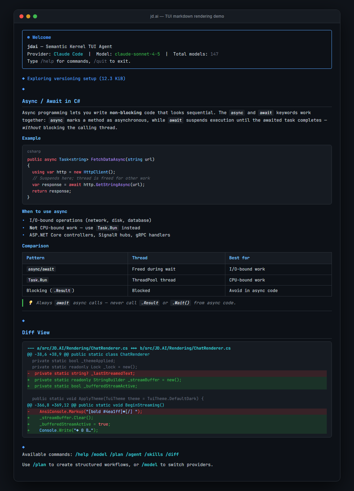
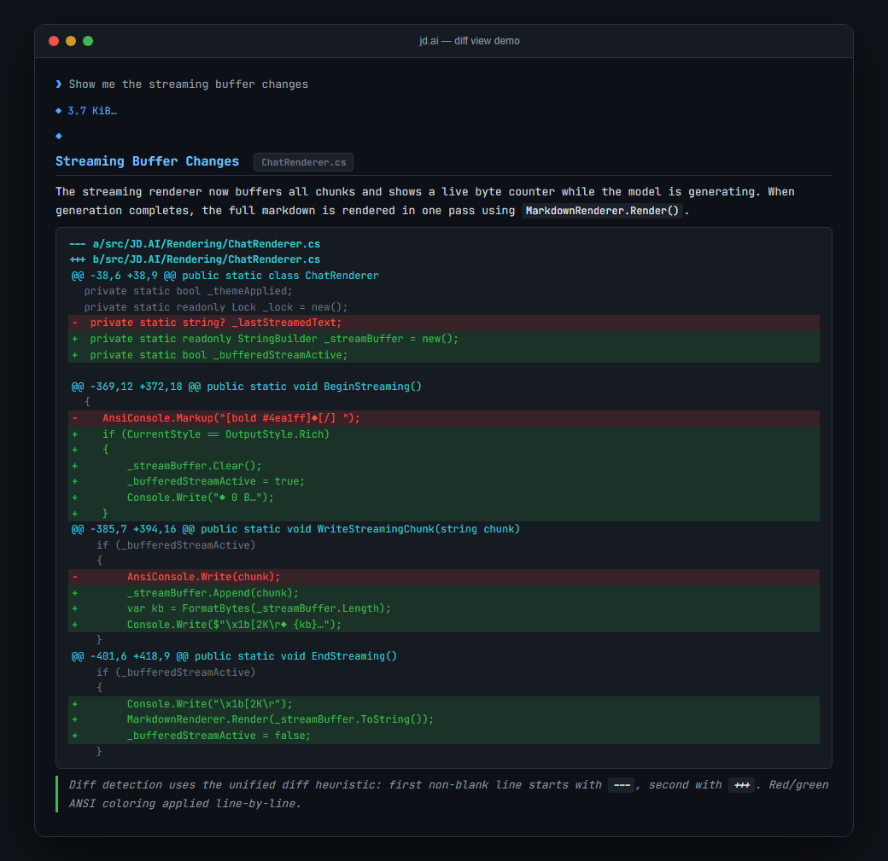

# TUI Rendering

In **Rich** output mode (the default), JD.AI renders AI responses as formatted text directly in the terminal. Markdown headings, bold and italic text, fenced code blocks with syntax highlighting, tables, and more are all rendered using Spectre.Console markup rather than shown as raw characters.

The rendering pipeline converts Markdig's abstract syntax tree (AST) into Spectre.Console markup tokens, which are then written to the terminal. Plain, Compact, and JSON output modes are unaffected — they receive raw text.



## Overview

| Capability | Details |
|------------|---------|
| Markdown rendering | Headings H1–H6, bold, italic, strikethrough, inline code, code blocks, ordered and unordered lists (nested), tables, blockquotes, horizontal rules |
| Syntax highlighting | 10 languages: C#, TypeScript, JavaScript, Python, Bash/Shell, SQL, YAML, Rust, Go, Java, HTML |
| Diff rendering | Auto-detected unified diff format; red/green/cyan coloring |
| Slash-command colorization | Known slash commands in prose appear in bold cyan |
| Streaming indicator | Live byte counter while generating; full render on completion |
| Output mode | Rich only — Plain/Compact/JSON output raw text |

Source: `src/JD.AI/Rendering/MarkdownRenderer.cs` and `src/JD.AI/Rendering/DiffRenderer.cs`.

## Markdown Rendering

JD.AI supports the full set of common Markdown elements. The following sections describe each, with an example of the Markdown input and how it appears in the terminal.

### Headings (H1–H6)

All six heading levels are supported. Headings are rendered at decreasing visual weight using Spectre.Console bold and color styles.

```markdown
# H1 Heading
## H2 Heading
### H3 Heading
#### H4 Heading
##### H5 Heading
###### H6 Heading
```

H1 and H2 are rendered prominently in the terminal header color. H3–H6 use progressively smaller emphasis.

### Emphasis

Standard inline emphasis elements are supported:

```markdown
**bold text**
*italic text*
~~strikethrough text~~
```

Renders as: **bold**, *italic*, and ~~strikethrough~~ in the terminal.

### Inline Code

Backtick-delimited inline code is rendered in a distinct highlight color:

```markdown
Run `dotnet build` to compile the project.
```

The inline code span (`dotnet build`) appears in a contrasting color without a code block border.

### Fenced Code Blocks

Code blocks enclosed with triple backticks are rendered in a bordered panel with syntax highlighting when the language is recognized (see [Syntax Highlighting](#syntax-highlighting)).

````markdown
```csharp
public async Task<string> GetResponseAsync(string prompt)
{
    return await _kernel.InvokeAsync(prompt);
}
```
````

Unrecognized or unlabeled code blocks are rendered with neutral coloring.

### Lists

Both ordered and unordered lists are supported, including nesting up to multiple levels.

```markdown
- Item one
- Item two
  - Nested item A
  - Nested item B
    - Deeply nested item

1. First step
2. Second step
   1. Sub-step
   2. Sub-step
3. Third step
```

Each nesting level is indented with visual bullet or number markers.

### Tables

Markdown tables are rendered as formatted Spectre.Console tables with column alignment:

```markdown
| Command       | Description                    |
|---------------|--------------------------------|
| `/help`       | Show available commands        |
| `/model`      | List or switch AI models       |
| `/output-style` | Change the output style      |
```

Tables respect left, center, and right column alignment specified in the separator row.

### Blockquotes

Blockquotes are indented and visually distinguished using a leading bar:

```markdown
> This is a blockquote.
> It can span multiple lines.
>
> And multiple paragraphs.
```

### Horizontal Rules

A horizontal rule (`---`, `***`, or `___`) is rendered as a full-width terminal divider.

```markdown
Section one content.

---

Section two content.
```

## Syntax Highlighting

Fenced code blocks with a recognized language identifier receive token-level syntax highlighting. The following languages are supported:

| Language identifier(s) | Tokens highlighted |
|------------------------|--------------------|
| `csharp`, `cs` | Keywords, strings, comments, types, attributes |
| `typescript`, `ts` | Keywords, types, strings, decorators |
| `javascript`, `js` | Keywords, strings, template literals, comments |
| `python`, `py` | Keywords, built-ins, strings, decorators |
| `bash`, `shell`, `sh` | Commands, flags, variables, strings |
| `sql` | Keywords (`SELECT`, `FROM`, `WHERE`…), strings, comments |
| `yaml`, `yml` | Keys, values, anchors, comments |
| `rust`, `rs` | Keywords, macros, lifetimes, types |
| `go` | Keywords, types, built-ins, comments |
| `java` | Keywords, annotations, types, strings |
| `html` | Tags, attributes, values, comments |

### Example — C\#

````markdown
```csharp
var kernel = Kernel.CreateBuilder()
    .AddOpenAIChatCompletion("gpt-4o", apiKey)
    .Build();

string result = await kernel.InvokePromptAsync("Explain TUI rendering.");
Console.WriteLine(result);
```
````

In Rich mode, keywords (`var`, `await`, `string`) appear in one color, string literals in another, and type names in a third, matching the active theme palette.

### Example — Bash

````markdown
```bash
jdai --provider openai --model gpt-4o --output plain
```
````

Commands, flags, and argument values each receive distinct coloring.

## Diff Rendering

When a response begins with unified diff preamble lines (`---`, `+++`) JD.AI automatically switches to diff rendering mode. The diff is displayed with the following coloring:

| Line type | Rendering |
|-----------|-----------|
| `---` file header | Cyan |
| `+++` file header | Cyan |
| `@@` hunk header | Cyan |
| `+` added lines | Green |
| `-` removed lines | Red |
| Context lines | Default terminal color |

This works for any unified diff output, including `git diff` output pasted into a prompt or returned by a tool call.



### Example

If the AI response contains:

```diff
--- a/src/Program.cs
+++ b/src/Program.cs
@@ -10,6 +10,7 @@
 using JD.AI.Core;
+using JD.AI.Rendering;
 
 var app = new Application();
-app.Run();
+await app.RunAsync();
```

The `---`/`+++` lines appear in cyan, removed lines (`-`) in red, and added lines (`+`) in green.

Diff rendering is handled by `DiffRenderer.cs` and is activated automatically — no user action is required.

## Slash-Command Colorization

When the AI response mentions a known JD.AI slash command by name (for example `/help`, `/model`, `/output-style`), those tokens are rendered in **bold cyan** to make them visually distinct from surrounding prose. This applies to inline mentions anywhere in paragraph text.

```text
You can switch models with /model, or view session history with /history.
```

In the terminal, `/model` and `/history` appear in bold cyan; the rest of the sentence remains in the default color.

This is purely cosmetic — the text is not made interactive. Only commands that are registered in the JD.AI command registry are colorized; unrecognized `/` tokens in prose are left unchanged.

## Streaming Indicator

JD.AI streams AI responses token by token. While a response is being generated, the terminal displays a live streaming indicator on a single line:

```text
◆ 1.2 KB…
```

The byte counter increments in real time as tokens arrive. This line is updated in place (using terminal cursor control) so it does not scroll the output.

When generation completes, the streaming indicator line is cleared, and the full response is rendered from the beginning as complete Markdown. This means syntax highlighting, tables, and other block-level elements are always rendered with complete context — they are never shown mid-token.

The streaming indicator is only shown in Rich output mode. In Plain and Compact modes, tokens are written directly to standard output as they arrive, which is more suitable for piping to other tools.

## Screenshots

The following screenshots illustrate Rich mode rendering:

| Screenshot | Description |
|------------|-------------|
| `docs/images/demo-rendering.png` | Markdown rendering — headings, lists, bold/italic, tables, code blocks |
| `docs/images/demo-diff-view.png` | Diff rendering — red/green/cyan unified diff coloring |

## Disabling Rich Rendering

To disable markdown rendering and receive plain text output, switch to Plain output mode:

```text
/output-style plain
```

In Plain mode, the AI response text is written to standard output without any Spectre.Console markup, ANSI color codes, or terminal control sequences. This is the recommended mode when piping output to another program or running JD.AI in a CI environment.

You can also set the output style persistently via the CLI flag:

```bash
jdai --output plain
```

Or in `~/.jdai/config.json`:

```json
{
  "outputStyle": "plain"
}
```

For details on all output modes and their trade-offs, see [Output Styles and Themes](output-styles.md).

## Related Topics

- [Output Styles and Themes](output-styles.md) — Switch between Rich, Plain, Compact, and JSON modes
- [Commands](commands.md) — Full list of slash commands including `/output-style` and `/theme`
- [Configuration](configuration.md) — Persist settings in `~/.jdai/config.json`
